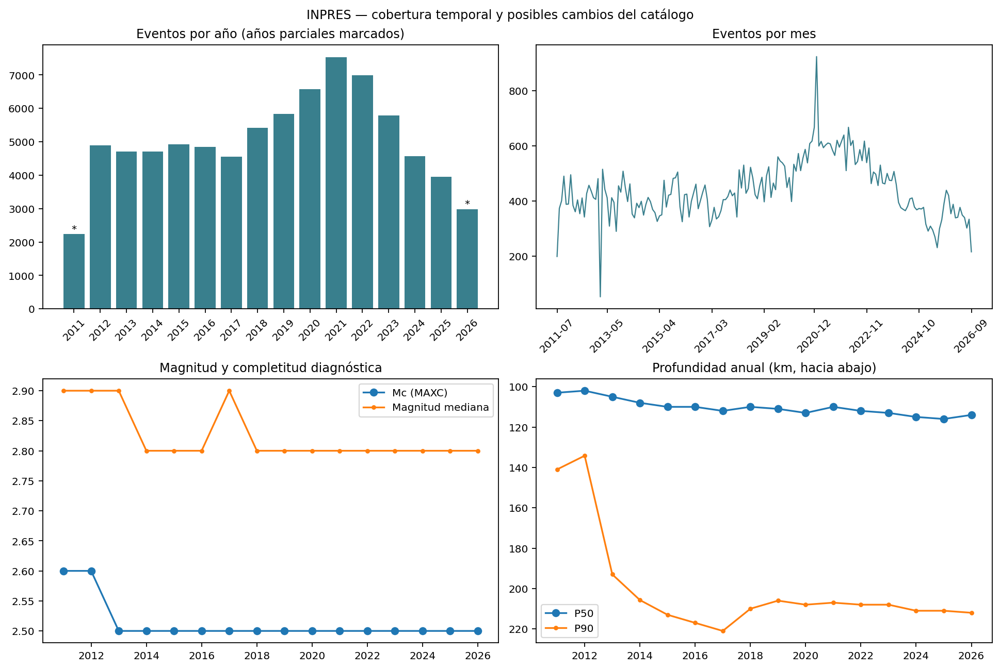
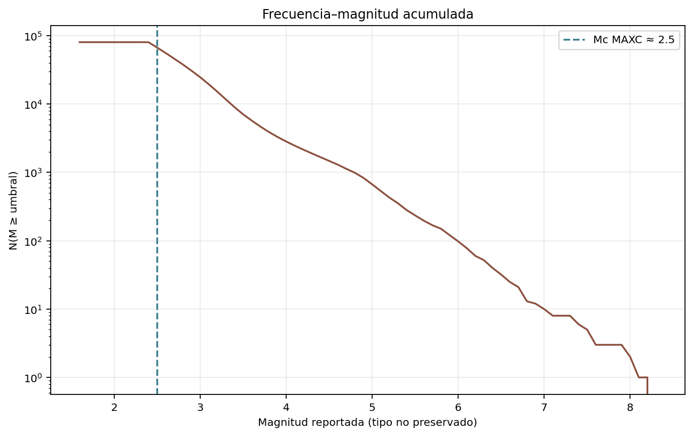
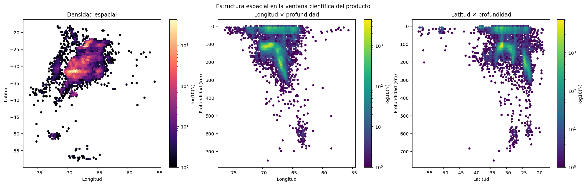
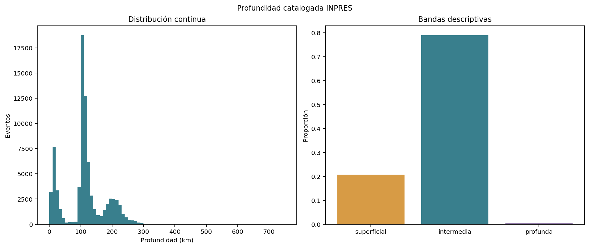
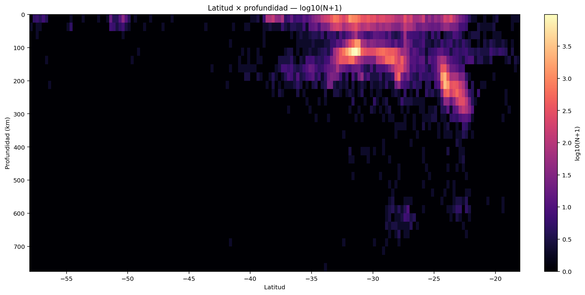
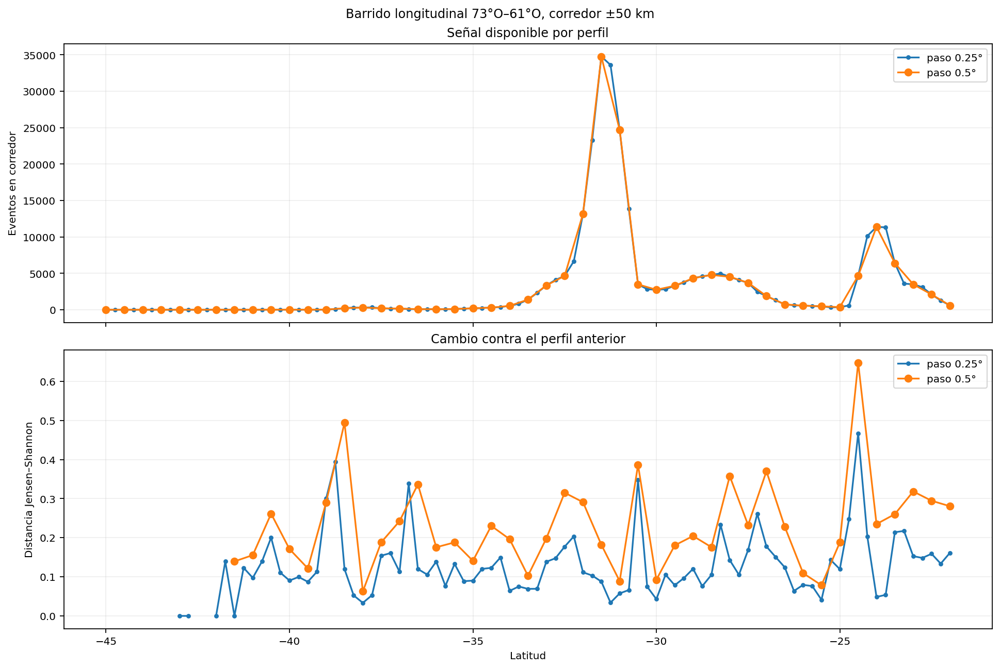
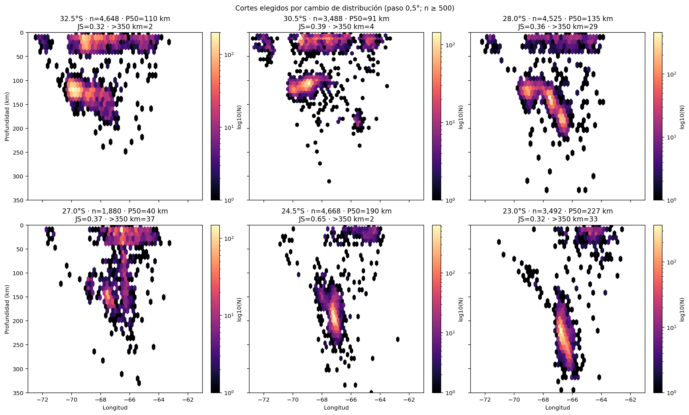
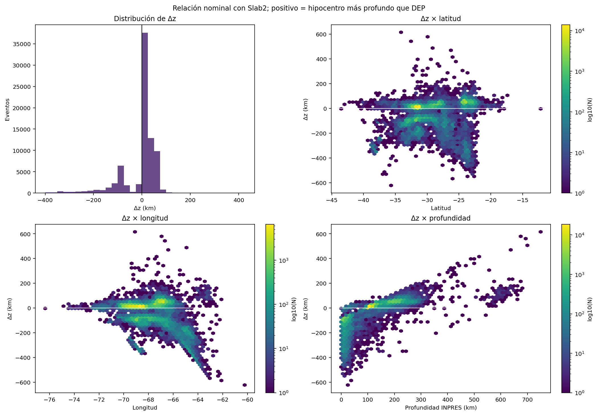
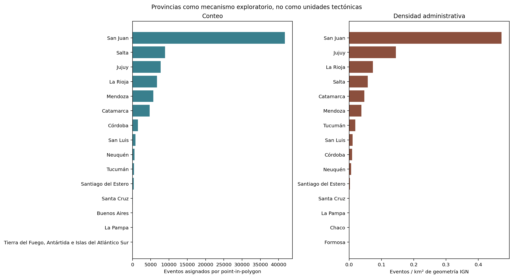

# EDA profundo del catálogo sísmico — primera entrega

Fecha del cálculo: 19 de septiembre de 2026.

Estado: análisis exploratorio reproducible para revisión. No modifica el
frontend, no incorpora datasets externos y no define todavía una historia
narrativa final.

El texto de alcance recibido termina abruptamente en «Pero solo añadirlo si
los…». Esta entrega cubre íntegramente las instrucciones disponibles hasta ese
punto y no inventa criterios posteriores que puedan haber quedado fuera del
archivo.

## Resumen ejecutivo

El catálogo actual contiene **80.524 eventos** entre el 16/07/2011 y el
18/09/2026. El dato no es homogéneo ni espacial ni temporalmente: más de la
mitad de los eventos asignados por geometría provincial cae en San Juan, los
conteos anuales crecen hasta 2021 y luego disminuyen, y la magnitud de
completitud diagnóstica cambia entre el centro y el norte.

Los resultados más prometedores para una futura narrativa no dependen de
Slab2:

1. La distribución longitud × profundidad cambia fuertemente al recorrer los
   Andes de norte a sur. Los cambios más contrastantes con al menos 500 eventos
   por corte aparecen alrededor de 24,5°S, 30,5°S, 27–28°S, 23°S y 32,5°S.
2. La profundidad tiene poblaciones muy distintas: 20,7 % superficial, 78,9 %
   intermedia y 0,35 % profunda bajo las bandas descriptivas fijadas. Además,
   131 eventos alcanzan 500 km o más y se concentran principalmente cerca de
   27–29°S y 63°O.
3. Las provincias sí producen «huellas» descriptivas reconocibles, pero las
   diferencias de completitud impiden comparar sus conteos crudos como si
   midieran actividad real. San Juan domina por cantidad; Jujuy y Salta por
   profundidad intermedia; Mendoza por una mezcla mucho más superficial;
   Santiago del Estero por su fracción de eventos profundos.
4. Después de entender el catálogo por sí mismo, la comparación con Slab2
   muestra que `Δz` varía mucho con la latitud. La mediana global es +12,3 km,
   pero pasa de aproximadamente −98,6 km a 27°S a +54,4 km a 24,5°S. Eso es una
   diferencia vertical nominal, no una distancia física certificada ni una
   clasificación tectónica.
5. El pico temporal más nítido es una concentración diaria de 98 eventos el
   19/01/2021 en una celda de 0,5° alrededor de 68,94°O, 31,82°S, seguida por
   actividad elevada varios días. Es candidata a revisión de secuencia, no una
   secuencia de réplicas ya identificada.

La conclusión de esta etapa es que el **barrido latitudinal merece ser la
columna vertebral del siguiente análisis**, pero todavía no una narrativa
cerrada. Para descubrimiento conviene el paso de 0,5°; el paso de 0,25° sirve
mejor para continuidad visual o para ampliar una transición ya detectada.

## 1. Alcance, repositorios y snapshot

Este EDA vive en `argentina-earthquakes`, repositorio canónico para
investigación y herramientas. Lee el catálogo desde el repositorio hermano
`inpres-sismos` sin duplicar ni modificar su scraping o normalización.

| Componente | Estado auditado |
|---|---|
| Producto | `argentina-earthquakes`, base `817b1fb6519536e81ae74783eb0f994f48771d05`, rama local `research/deep-catalog-eda` |
| Proveedor | `inpres-sismos`, commit `c5634cac3bb3d3757ed79dfd897b58c128fb5798`, rama `feat/historical-earthquakes-media` |
| Catálogo maestro | `data/sismos.csv`, 4.818.108 bytes, SHA-256 `839a061f9877df6ed596b1bb0c73f3471d352add046dbf56a20d7f47f84c32f6` |
| Export GeoJSON | 80.524 features, SHA-256 `8c55d8f1608b149e2c9adc19e67ce20ef3ddb1f4eaf2b5af27147272551f1af7` |
| Slab2 | South America `02.23.18`; DEP, DIP, STR, THK, UNC y CLP disponibles |
| GEBCO | GEBCO 2026; zips locales del 07/08 y 18/09; usado aquí sólo como contexto auditado |
| IGN | 24 geometrías provinciales EPSG:4326; versión y URL exacta todavía no registradas |
| Natural Earth | Admin 0, versión 5.1.1; contexto cartográfico, no usado en métricas |

El manifiesto del producto todavía describe el snapshot anterior de 80.470
eventos del 14/09/2026. El catálogo y GeoJSON locales ya contienen 80.524 hasta
el 18/09/2026. Esto es **drift de snapshot**, no un error del EDA; el manifiesto
no se actualizó en esta rama para no convertir una auditoría en una decisión de
publicación. La metadata exportada también conserva una URL histórica bajo
`LuisOVaras`, aunque los remotos Git locales ya apuntan a `Sismos-Argentina`.

### Inventario de datos locales

| Familia | Archivos / esquema | Papel en esta entrega |
|---|---|---|
| Catálogo INPRES maestro | `sismos.csv`: 80.524 × 8; fecha, hora, latitud, longitud, profundidad, magnitud, provincia, sentido | Fuente observacional primaria |
| Copias/intermedios del proveedor | `sismos.csv.bak` 76.065; `sismos_nuevos.csv` 2.019; `sismos_sin_formatear.csv` 1.485 | Auditados, no concatenados para evitar duplicar responsabilidades del proveedor |
| Base SQLite | tabla `sismos` 80.524 × 9; tabla histórica 80 × 6 | Representación alternativa del mismo catálogo |
| Export enriquecido | GeoJSON y JSON recientes con ID derivado, ubicación normalizada, provincia, país y banderas | Auditados; el EDA parte del CSV maestro |
| Catálogo histórico | 80 terremotos con fecha, provincia, descripción, latitud y longitud; fotos asociadas | Fuera del EDA instrumental 2011–2026 |
| Slab2 SAM | grillas de 0,05° DEP/DIP/STR/THK/UNC, CLP, contornos y shapefiles | Modelo externo; se interpola sólo con cuatro nodos válidos y dentro de CLP |
| GEBCO | GeoTIFF/NetCDF/ASCII/documentación según zip; artefactos web científico y contextual | Contexto topográfico/batimétrico; no se usa para inferir estructura sísmica |
| IGN | país y provincias en Shapefile/GeoJSON | Point-in-polygon administrativo y áreas en EPSG:6933 |
| Natural Earth | países 1:10m | Contexto; no entra en cálculos |

### Campos, unidades y convenciones del catálogo

| Campo fuente | Tipo observado | Convención / límite |
|---|---|---|
| `fecha` | texto `DD/MM/YYYY` | 16/07/2011–18/09/2026 |
| `hora` | texto `HH:MM:SS` | No conserva zona horaria; se analiza como tiempo local ingenuo |
| `latitud` | decimal | grados, sur negativo; rango −64,982 a +47,81 |
| `longitud` | decimal | grados, oeste negativo; rango −78,661 a +174,99 |
| `profundidad` | texto | km; aparecen sufijos `Km` y `Km.`; datum vertical no documentado |
| `magnitud` | decimal | 1,6–8,3; tipo de magnitud no preservado |
| `provincia` | texto libre | 31 faltantes; mezcla provincias, países, océanos y variantes con encoding |
| `sentido` | texto | `Si` / `No`; no equivale a intensidad ni a garantía de no percepción |

El export GeoJSON usa EPSG:4326 y coordenadas `[longitud, latitud]`. Sus IDs de
16 caracteres son hashes derivados, no identificadores oficiales de INPRES.
Para provincias se ignoró el texto libre y se ejecutó point-in-polygon contra
IGN.

## 2. Calidad y limitaciones

### Integridad básica

- 80.524 filas; cero timestamps, coordenadas, magnitudes o profundidades sin
  parsear después de admitir `Km` y `Km.`.
- Cero filas exactamente duplicadas y cero duplicados al comparar fecha, hora,
  coordenadas, profundidad y magnitud exactas.
- Cero coordenadas fuera de rangos globales, cero profundidades negativas y
  cero magnitudes no positivas.
- 21 eventos tienen profundidad 0 km. Son válidos sintácticamente, pero deben
  considerarse sospechosos hasta revisar su significado en la fuente.
- Un evento supera 700 km: 750 km en Mendoza, 05/04/2018. Otro alcanza 700 km
  en Catamarca, 09/07/2013. Se preservan como alertas, no se corrigen.
- 262 eventos quedan fuera de la ventana científica del producto
  (82°O–52°O, 58°S–18°S). La mayoría corresponde a Tierra del Fuego,
  Sandwich/Georgias del Sur, Orcadas, Península Antártica y Drake.

### Completitud de magnitud

El estimador exploratorio MAXC con bin de 0,1 da `Mc ≈ 2,5` global y
`b ≈ 0,8655 ± 0,0030` por Aki–Utsu. La incertidumbre formal no captura
heterogeneidad espacial, dependencia entre eventos, mezcla de tipos de
magnitud ni cambios de red, por lo que no debe leerse como precisión física.

La evidencia más útil es el corte abrupto del catálogo: **80.469 de 80.524
eventos están en M ≥ 2,5**. En 2011–2012 MAXC da 2,6 y desde 2013 da 2,5. A
nivel provincial, Salta y Jujuy dan 3,1, mientras la mayoría de provincias con
muestra suficiente da 2,5. Por eso:

- M ≥ 2,5 es un umbral global práctico para este snapshot;
- comparaciones norte–centro deberían repetir métricas con M ≥ 3,1;
- MAXC solo no basta para certificar completitud; falta contrastar con métodos
  de goodness-of-fit/estabilidad y bootstrap por períodos y regiones.

### Tiempo y no estacionariedad

Los años completos 2012–2017 tienen aproximadamente 4.500–4.900 eventos. El
conteo crece desde 2018 hasta 7.532 en 2021 y baja luego a 3.949 en 2025. 2011 y
2026 son parciales. La profundidad mediana cambia gradualmente de 102–103 km
en 2011–2012 a 114–116 km en 2024–2026, mientras P90 salta de 134–141 km a
193 km en 2013 y supera 200 km desde 2014.

Estos cambios son reales dentro del archivo, pero su causa no está resuelta.
Pueden combinar cambios de cobertura/detección, composición regional y
secuencias sísmicas. No sostienen la frase «Argentina tiene cada vez más
terremotos».





## 3. Estructura espacial y profundidad

La ventana científica contiene 80.262 eventos. La distribución presenta:

- una concentración excepcional en Cuyo, especialmente San Juan;
- poblaciones intermedias alrededor de 100–140 km en el centro y de
  180–260 km hacia el norte;
- una población profunda estrecha cerca de 27–29°S y alrededor de 63°O;
- poblaciones australes y oceánicas mucho más escasas y separadas.



| Profundidad descriptiva | Eventos | Proporción |
|---|---:|---:|
| 0 ≤ d < 70 km | 16.697 | 20,74 % |
| 70 ≤ d < 300 km | 63.549 | 78,92 % |
| 300 ≤ d < 500 km | 147 | 0,18 % |
| 500 ≤ d < 700 km | 129 | 0,16 % |
| d ≥ 700 km | 2 | <0,01 % |

Media: 113,9 km. Mediana: 110 km. P10/P25/P50/P75/P90/P95:
14/99/110/135/207/225 km. Estas bandas son descriptivas, no clases tectónicas.





## 4. Barrido latitudinal

Se evaluaron centros entre 45°S y 22°S, extremos 73°O–61°O y corredor de
±50 km. Para cada centro se proyectaron eventos a una proyección azimutal
equidistante local WGS84 y se midió distancia al segmento. El cambio entre
perfiles usa distancia de Jensen–Shannon sobre histogramas de profundidad de
25 km con suavizado de 0,5 eventos.

| Paso | Centros | Eventos medianos | Jaccard adyacente mediano | Cambio JS mediano |
|---|---:|---:|---:|---:|
| 0,25° | 93 | 471 | 0,553 | 0,113 |
| 0,5° | 47 | 471 | 0,250 | 0,201 |

El paso de 0,25° reutiliza más de la mitad de los eventos entre perfiles
adyacentes y produce una señal más suave. El de 0,5° reduce la redundancia y
duplica aproximadamente el contraste mediano. Recomendación:

- **0,5° para descubrimiento y priorización**;
- **0,25° para inspección fina e interacción visual continua**.

Cambios principales con paso 0,5° y al menos 500 eventos:

| Latitud | n | P50 profundidad | JS vs. anterior | Mediana Δz |
|---:|---:|---:|---:|---:|
| 24,5°S | 4.668 | 190 km | 0,648 | +54,4 km |
| 30,5°S | 3.488 | 91 km | 0,386 | +1,4 km |
| 27,0°S | 1.880 | 40 km | 0,370 | −98,6 km |
| 28,0°S | 4.525 | 135 km | 0,357 | +33,4 km |
| 23,0°S | 3.492 | 227 km | 0,318 | +50,0 km |
| 32,5°S | 4.648 | 110 km | 0,315 | +8,6 km |

31°S no fue seleccionado por el criterio de cambio. Sigue siendo útil como
perfil previamente validado, pero este barrido descubre transiciones más
fuertes en otras latitudes.





## 5. Relación nominal con Slab2

Se cargaron DEP, DIP, STR, THK y UNC de la grilla SAM 0,05°. Para cada evento se
exigió estar dentro de CLP y tener cuatro nodos finitos. No se extrapoló. Se
obtuvo DEP para 80.046 eventos (99,41 % del catálogo).

La convención es:

`Δz = profundidad INPRES − profundidad Slab2 DEP`

Por tanto, `Δz > 0` significa que el hipocentro queda nominalmente más profundo
que la superficie DEP. No significa «debajo de la placa», porque DEP no es un
volumen, falta resolver los datums verticales y no se calcula la normal 3D.

Resultados globales:

- mediana Δz: +12,3 km;
- P10/P90: −99,1/+55,4 km;
- mediana |Δz|: 25,4 km;
- 17.630 eventos con |Δz| ≤ 10 km;
- 39.721 con |Δz| ≤ 25 km;
- 52.923 con |Δz| ≤ 50 km.

Estas proporciones describen relación geométrica con el modelo; no son
proporciones de eventos de Nazca. El catálogo y Slab2 tampoco son fuentes
estadísticamente independientes.

La variación norte–sur es más importante que el resumen global. En los cortes
seleccionados por los datos, la mediana pasa de valores cercanos a cero en
30,5–32,5°S a +33 km en 28°S, −99 km en 27°S y +50–54 km en 23–24,5°S.
Esto refuerza que una sola relación catálogo–modelo no representa todo el país.

DIP, STR y THK se conservaron en la tabla por latitud para futura inspección,
pero no se les atribuyó explicación tectónica. No se calculó distancia 3D
mínima: hacerlo ahora daría una precisión engañosa por datum vertical,
curvatura y definición de superficie.



## 6. Magnitud y eventos extremos

Hay 3.306 eventos M ≥ 4 y 831 eventos M ≥ 5. El catálogo incluye eventos fuera
de Argentina y del dominio científico principal; por ejemplo, los mayores
registros incluyen Chile, Pacífico y Sandwich del Sur. No se deben presentar
como «los mayores terremotos de Argentina» sin filtro territorial y revisión de
fuente.

Los archivos `large_event_candidates.csv` y `deep_event_candidates.csv`
preservan fecha, hora, coordenadas, profundidad, magnitud, ubicación fuente y
fila del CSV. Son listas de verificación, no afirmaciones de causalidad o de
identidad con catálogos externos.

La población de 131 eventos con d ≥ 500 km tiene mediana espacial aproximada
63,32°O, 27,11°S; sus percentiles 10–90 abarcan 64,11–62,87°O y
28,64–22,38°S. Sobresalen:

- 750 km en Mendoza, 05/04/2018;
- 700 km en Catamarca, 09/07/2013;
- una concentración alrededor de Santiago del Estero, incluida M 6,9 a
  635 km el 02/09/2011.

Cada caso requiere confirmar que no sea error o diferencia de solución antes
de usarlo narrativamente.

## 7. Tiempo y candidatos de secuencia

Los picos diarios nacionales mezclan regiones no relacionadas. Por eso se creó
además una búsqueda conservadora por día y celda de 0,5°.

El candidato dominante está cerca de 68,94°O, 31,82°S:

- 98 eventos el 19/01/2021;
- 55 el 20/01;
- 22–27 por día entre el 21 y el 23;
- actividad elevada continúa hasta fin de mes.

La concentración es cuantitativamente clara, pero el EDA no asocia eventos a
un principal ni aplica una ventana de declustering. Se etiqueta solamente como
**candidato de secuencia**. Otros candidatos aparecen el 28/12/2012 cerca de
65,10°O, 31,38°S y el 20/11/2016 cerca de 68,70°O, 31,60°S.

## 8. Provincias como interfaz pública

El point-in-polygon IGN asignó 79.252 eventos y dejó 1.272 sin provincia. Se
reparó una geometría inválida antes del cruce. Las áreas se calcularon en
EPSG:6933; la geometría fue tomada tal como está y puede incluir territorios
multipartidos. Los nombres se restauraron desde códigos IGN porque los
atributos disponibles contienen caracteres corruptos.

Perfiles contrastantes:

| Provincia | n | Mc local | P50 profundidad | % superficial | % intermedia | % profunda |
|---|---:|---:|---:|---:|---:|---:|
| San Juan | 41.740 | 2,5 | 106 km | 12,2 | 87,7 | 0,02 |
| Salta | 8.927 | 3,1 | 194 km | 9,0 | 90,3 | 0,74 |
| Jujuy | 7.683 | 3,1 | 221 km | 9,6 | 89,4 | 1,02 |
| Mendoza | 5.691 | 2,5 | 31 km | 54,9 | 45,1 | 0,05 |
| Santiago del Estero | 338 | 2,5 | 29 km | 64,2 | 10,1 | 25,7 |

Hay señal suficiente para una «huella sísmica» provincial, especialmente al
comparar forma de la distribución y no sólo cantidad. Requisitos antes de
llevarlo al frontend:

- repetir conteos con umbral local común, por ejemplo M ≥ 3,1 para comparar
  norte y centro;
- no usar eventos/km² como riesgo o peligro;
- mostrar tamaño de muestra y período;
- revisar la versión/licencia/fuente exacta de IGN;
- no convertir límites administrativos en explicaciones geológicas.



## 9. Registro de hallazgos candidatos

| ID | Hallazgo | Evidencia | Robustez | Interés visual | Necesita bibliografía | Posible uso |
|---|---|---|---|---|---|---|
| H01 | El catálogo tiene un corte efectivo cercano a M 2,5 y Mc mayor en Salta/Jujuy | 80.469/80.524 en M≥2,5; Mc local 3,1 al norte | Alta internamente; método inicial | Medio | Sí, para interpretar red/catálogo | Umbral honesto para comparaciones |
| H02 | La geometría longitud–profundidad cambia con fuerza en latitudes no elegidas previamente | Máximos JS robustos en 24,5°, 30,5°, 27–28°, 23° y 32,5°S | Alta dentro del corredor; depende de ancho/bin | Muy alto | Sí | Recorrido norte–sur y selección de perfiles |
| H03 | Existe una población profunda concentrada cerca de 27–29°S, 63°O | 131 eventos ≥500 km; mediana 27,11°S, 63,32°O | Alta descriptiva; eventos extremos a verificar | Muy alto | Sí | Lente de profundidad extrema |
| H04 | La relación nominal con DEP cambia de signo y magnitud norte–sur | Δz mediana −98,6 km a 27°S y +54,4 km a 24,5°S | Alta numérica; baja como explicación física | Muy alto | Sí | Mostrar límites del modelo y comparación |
| H05 | Las provincias tienen huellas de profundidad distintas | Jujuy P50 221 km; Mendoza 31 km; Santiago 25,7 % profunda | Media-alta; sesgada por completitud y n | Alto | Sí | Selector provincial descriptivo |
| H06 | Enero de 2021 contiene una concentración espacio-temporal excepcional en San Juan | 98 eventos/celda/día y varios días consecutivos | Alta como conteo; no declusterizada | Alto | Sí | Candidato a secuencia contextualizada |
| H07 | El catálogo no es temporalmente estacionario | 4,5–4,9k/año en 2012–17; pico 7.532 en 2021; 3.949 en 2025 | Alta descriptiva; causa no resuelta | Medio | Sí | Explicar límites de tendencias |

La misma tabla está disponible como `findings_candidates.csv` para mantenerla
actualizable sin convertirla en narrativa definitiva.

## 10. Qué no se concluye

- No se validó Slab2 con INPRES ni se clasificaron eventos como Nazca.
- No se afirmó que `Δz` sea distancia normal, espesor o error del modelo.
- No se afirmó aumento o disminución de la sismicidad argentina.
- No se identificaron réplicas ni causalidad entre eventos.
- No se interpretaron provincias como unidades tectónicas.
- No se corrigieron profundidades extremas por intuición.
- No se usó GEBCO para inferir estructuras subsuperficiales.
- No se agregaron catálogos o bibliografía nuevos en esta rama.

## 11. Siguiente fase propuesta, sujeta a aprobación

1. Validar Mc con al menos un segundo método, ventanas temporales y regiones
   comparables; fijar un umbral común conservador.
2. Repetir el ranking latitudinal con sensibilidad a corredor ±25/50/75 km,
   bins de profundidad y períodos 2011–2015, 2016–2020 y 2021–2026.
3. Revisar manualmente H02, H03 y H06 contra registros fuente y bibliografía.
4. Sólo después, evaluar regiones naturales o clustering simple; no hay
   justificación todavía para ML sofisticado.
5. Mantener 0,5° como barrido de descubrimiento y 0,25° como zoom.
6. Resolver la referencia vertical antes de implementar distancia 3D a Slab2.

## Reproducción y artefactos

```powershell
python -m pip install -r tools/eda/requirements.txt
python tools/eda/catalog_eda.py
python tests/test_catalog_eda.py
```

`run_metadata.json` guarda hashes, versiones, métodos, resumen de calidad y
limitaciones. Los CSV contienen las series completas usadas en este informe.
Las figuras se generan desde cero y no modifican los datasets fuente.
